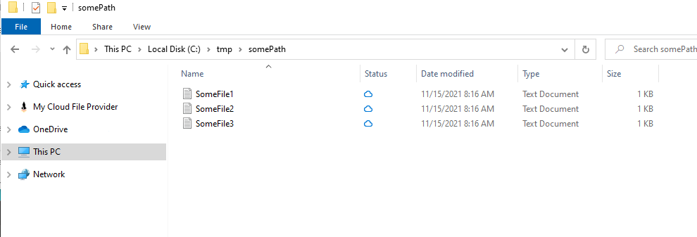
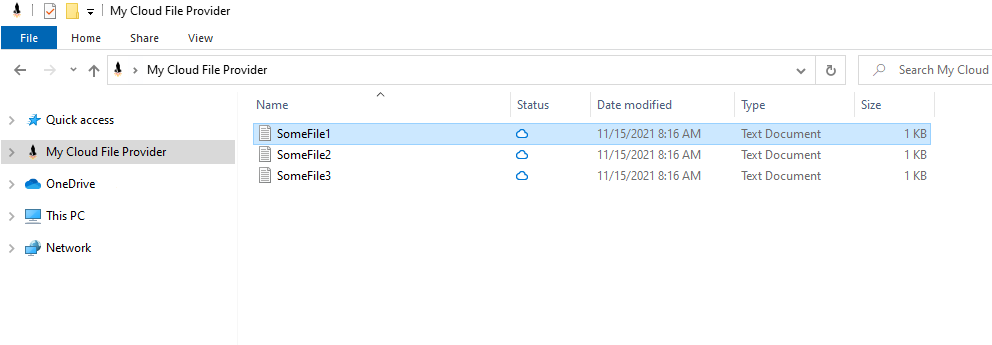
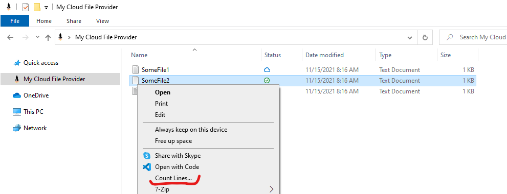
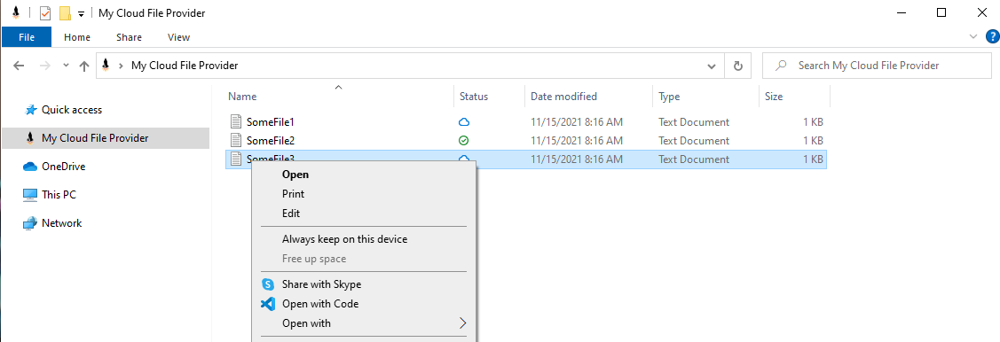
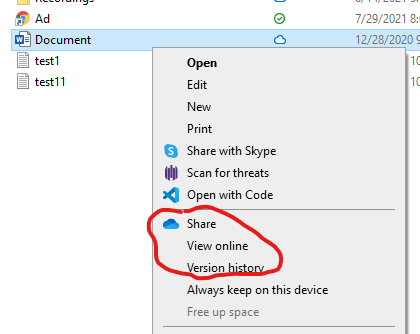
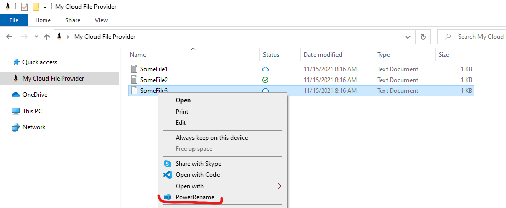
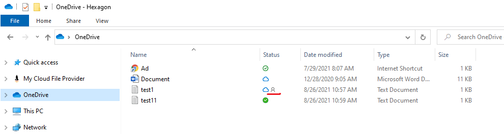

# Files On-Demand

We must prepare application similar to OneDrive on Windows - synchronization list of files stored in cloud and synchronization of selected files.

During the investigation we found very nice librarry to manage On-Demand Files in Windows from C# - [ShellBoost](https://www.shellboost.com/Doc/Introduction/Overview). 

## List files from cloud as local files

Show list of on-demand files in local folder

Show folder with files as Namespace extension

With [ShellBoost](https://www.shellboost.com/Doc/Introduction/Overview) we can synchronize file in very cool way. We can show sync status, we can do all operations like on regular files, additionally we can synchronize item or remove from synchronization.

Unfortunately, we met some restrictions

## File Context Menu Items problem

We are not able to add custom actions to not synchronized file.
I used [SharpShell](https://github.com/dwmkerr/sharpshell) to manage additional context menu items on files - it works

But on not synchronized files it doesn't work.

### OneDrive supports custom context menu item

Somehow OneDrive is able to add custom menu items

### PowerToys can add custom context menu item

Somehow PowerToys is able to add custom menu items to our not synchronized files

## File Status column problem

Second problem is that with [ShellBoost](https://www.shellboost.com/Doc/Introduction/Overview) and Files On-Demand we can't set additional icons in status column, like OneDrive does it

## Summary

We have two problems with Files-OnDemand
1. Context menu
2. Custom statuses

We haven't knowledge how to solve them.
